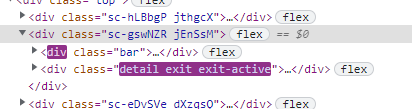

## tsconfig.json 配置相对路径引用无效
```ts
    "paths": {
      "@/*": ["src/*"]
    } 
```

react18 create-react-app5   默认使用webpack中配置的 alias 别名，不支持tsconfig.json 配置相对路径
暂代方法：
webpack 配置中添加 alias 别名配置

残留问题：
多入口配置下，子项目内相对路径配置引用问题待解决


## material-ui  使用 style-component 模式 安装使用报错
使用 style-component 模式仍需要安装 @emotion/react @emotion/styled
```
npm install @mui/material @emotion/react @emotion/styled @mui/styled-engine-sc styled-components
```
## 组件路径动态引入报错
相同路径 静态导入可以  动态导入报错 'src/apps/airbnb/src/demo/indicator'
解决： 动态导入的路径 首尾使用静态字符 才能正确导入
```ts
const DEMOS = require['context']('../demo/',true,/\.tsx$/);
const demoRoutes: any[] = [];
DEMOS.keys().forEach((key) => {
  // key => ./indicator/index.tsx
  // DEMOS.resolve(key) => ./src/apps/airbnb/src/demo/indicator/index.tsx
  let pathname = key.match(/\/.*?\/index\.tsx$/)[0];// => /${demoname}/index.tsx
  pathname = pathname.replace(/\/index\.tsx$/,'')// => /${demoname}
  let elementPath = DEMOS.resolve(key).replace(/\.\//,'').replace(/src\//,'').replace(/\/index\.tsx$/,'')
  console.log('demo',pathname,elementPath);
  // 首尾使用静态字符 否则引入失败
  const Demo = React.lazy(() => import('src/' + elementPath + '/index'));
  demoRoutes.push({
    path: pathname,
    element: <Demo />
  })
});

```


## 使用 react-transition-group:CSSTransition 动画不生效

原因：使用 CSSTransition 生成的生命周期样式类不是 *-enter、*-enter-active、*-exit、*-exit-active 而是 enter、enter-acitve ... （使用 SwitchTransition 包裹 SwitchTransition 时 添加样式类正常），且 CSSTransition 内包裹的外层元素会被 CSSTransition 替换。


