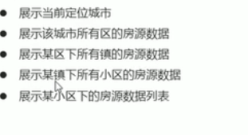

# 好客租房项目
## 移动web端
## 项目介绍:在线租房项目
## 核心业务
### 在线找房(地图 条件搜素)
城市选择 地图找房 搜索
租房小组：
根据用户地理位置不同，显示不同小组信息
资讯：
根据用户找房数据，推荐用户感兴趣的内容

h5 获取地理位置：
根据当前地理位置，获取当前城市房源信息

```
用h5的geolocation 获取经纬度，通过地图api将经纬度转换成详细的地址以及地图。
由于国内的地图产品，其地理位置大多数都进行了GCJ-02加密，即加入随机的偏差。
而html5原生的定位API获取到的地理位置，是未经加密的。

因此地理位置定位误差较大。

要用使用官方提供的地理位置信息转换的类进行转换

```

高德 jsapi 获取地理位置


地图找房：



### 用户登录
### 房源发布
## 技术栈
react react-dom  react-router-dom
axios
antd-mobile
react-virtualized  formik+yup react-spring
百度地图api

## 组件切换
### 动态引入组件：
示例：
```jsx
import React, { Suspense } from 'react';
import OtherComponent from './OtherComponent';

React.lazy 函数 像渲染常规组件一样处理动态引入（的组件）
const OtherComponent = React.lazy(() => import('./OtherComponent'));


Suspense 组件中渲染 lazy 组件，可以在等待加载 lazy 组件时做优雅降级（如 loading 指示器等）
function MyComponent() {
  return (
    <div>
      <Suspense fallback={<div>Loading...</div>}>
        <OtherComponent />
      </Suspense>
    </div>
  );
}
```


### 组件切换
React.startTransition 进行组件切换过渡展示，当组件未准备好渲染内容时，展示旧的ui，优化用户体验。

```jsx
function handleTabSelect(tab) {
  startTransition(() => {
    setTab(tab);
  });
}
```


### 异常捕获

## react-router
### 路由基础（BrowserRouter Routes Route）
#### BrowserRouter 用于包裹需要路由的组件，通常在应用的最外层使用。

**HashRouter 作用与`BrowserRouter`一样，但`HashRouter`修改的是地址栏的hash值。**

#### Route
Route 用于定义一个访问路径与 react 组件之间的关系。`path => 路径`  `element => 组件`
- `caseSensitive` 属性用于指定：匹配时是否区分大小写（默认为 false）
#### Routes
Routes 用于包裹一系列Route，决定访问路径对应加载的react组件。 当url发生变化时，Routes 会查看其所有子元素找到对应组件并呈现

```jsx
function App() {
  return (
    <BrowserRouter>
      <Suspense fallback={<div>Loading...</div>}>
        <Routes>
          <Route path="/main" element={<Home />}  />
          <Route path="citylist" element={<CityList />} />
        </Routes>
      </Suspense>
    </BrowserRouter>
  );
}
```


#### 404页面
通配符匹配所有不存在的路径
```jsx
<Route path="*" element={<NotFound />} />
```


#### 嵌套路由
配置嵌套路由，父级路由需 添加 `/*` 才会继续对子路由进行深度匹配。
```jsx
function App() {
  return (
    <Router>
      <Suspense fallback={<div>Loading...</div>}>
        <Routes>
          {/* 父级路由 */}
          <Route path="/main/*" element={<Home />}  >
          </Route>
        </Routes>
      </Suspense>
    </Router>
  );
}

{/* 子级路由 */}
  return (
    <div className="home">
      <Routes>
        <Route path="/" element={<Index />} />
        <Route path="/news" element={<News />} />
        <Route path="/profile" element={<Profile />} />
      </Routes>
    </div>
  );
```


### 路由跳转及传参
#### Link
作用: 修改URL，且不发送网络请求（路由链接）。

```jsx
<Link to="/path">点击跳转路由</Link>
```
#### NavLink
作用: 与 `Link` 组件类似，可实现导航的“高亮”效果。


#### useNavigate
hooks:useNavigate  hooks 只能在 function 组件中使用。

```jsx
import { useNavigate } from "react-router-dom";
const navigate = useNavigate();
navigate('/path');
```


### 路由鉴权


模块加载失败（如网络问题）会触发一个错误。可以通过异常捕获便捷技术处理，以显示良好的用户体验并管理恢复事宜。
```jsx
import React, { Suspense } from 'react';
import MyErrorBoundary from './MyErrorBoundary';

const OtherComponent = React.lazy(() => import('./OtherComponent'));
const AnotherComponent = React.lazy(() => import('./AnotherComponent'));

const MyComponent = () => (
  <div>
    <MyErrorBoundary>
      <Suspense fallback={<div>Loading...</div>}>
        <section>
          <OtherComponent />
          <AnotherComponent />
        </section>
      </Suspense>
    </MyErrorBoundary>
  </div>
);
```


## Geolocation
Geolocation 接口是一个用来获取设备地理位置的可编程的对象，它可以让 Web 内容访问到设备的地理位置，这将允许 Web 应用基于用户的地理位置提供定制的信息。

- Geolocation.getCurrentPosition()
确定设备的位置并返回一个携带位置信息的 Position 对象。

- Geolocation.watchPosition()
注册一个位置改变监听器，每当设备位置改变时，返回一个 long 类型的该监听器的 ID 值。

- Geolocation.clearWatch()
取消由 watchPosition() 注册的位置监听器。

### Geolocation.getCurrentPosition()
 Geolocation.getCurrentPosition()确定设备的位置并返回一个携带位置信息的 Position 对象。

Position 接口表示在给定的时间的相关设备的位置。返回一个 Coordinates 对象和时间戳。 Coordinates对象用来表示设备的位置。

Coordinates：
```
latitude 当前位置纬度
longitude 当前位置精度
altitude 海拔高度(不存在为null)
accuracy 获取到的经度或纬度的精度(m)
altitudeAccuracy 海拔高度的精度(m)
heading 设备前进方向(用面朝正北的顺时针角度来表述,不存在为null)
speed 前进速度(m,不存在为null)
timestamp 获取位置信息的时间戳

[MDN](https://developer.mozilla.org/zh-CN/docs/Web/API/GeolocationCoordinates)
```


### 获取到的地理位置跟GPS、IP地址、WIFI和蓝牙的MAC地址、GSM/CDMS的ID有关
比如：手机优先使用 GPS 定位，笔记本等最准确的定位是WIFI

根据网络环境的不同，定位的精准度也会有一定的偏差。


## 高德地图 JSApi 使用

### 定位

#### 获取当前所在城市信息
##### CitySearch：IP定位获取当前所在城市信息
```jsx
// 插件 CitySearch getLocalCity 方法 获取当前城市信息
const citySearch = new AMap.CitySearch();
citySearch.getLocalCity(function (status, result) {
  if (status === "complete" && result.info === "OK") {
    // 查询成功，result即为当前所在城市信息
  }
});
```


## hook
https://zh-hans.reactjs.org/docs/hooks-intro.html

作用：组件之间复用状态逻辑很难，使用 Hook 从组件中提取状态逻辑，使得这些逻辑可以单独测试并复用。Hook 使你在无需修改组件结构的情况下复用状态逻辑


Hook 使你在非 class 的情况下可以使用更多的 React 特性

### 什么是 Hook?

Hook 是一些可以让你在函数组件里“钩入” React state 及生命周期等特性的函数。Hook 不能在 class 组件中使用 —— 这使得你不使用 class 也能使用 React。（我们不推荐把你已有的组件全部重写，但是你可以在新组件里开始使用 Hook。）

React 内置了一些像 useState 这样的 Hook。你也可以创建你自己的 Hook 来复用不同组件之间的状态逻辑。我们会先介绍这些内置的 Hook。


### State Hook

state hook 使用 数组解构语法。
`const [state, setState] = useState(initialState);`
```jsx
  const [fruit, setFruit] = useState('banana');
  // 创建 fruit  和 setFruit 两个变量
  // 第一个值 fruit  是当前的state
  // 第二个值是更新当前state的函数
  
  // 更新值
  setFruit('apple')

  // 声明多个 state 变量
  const [age, setAge] = useState(42);
  const [fruit, setFruit] = useState('banana');
  const [todos, setTodos] = useState([{ text: '学习 Hook' }]);
```


### Effect Hook
在 React 组件中执行数据获取、订阅或者手动修改 DOM 的操作称为“副作用”，或者简称为“作用”。

useEffect 就是一个 Effect Hook，给函数组件增加了操作副作用的能力。它跟 class 组件中的 componentDidMount、componentDidUpdate 和 componentWillUnmount 具有相同的用途，只不过被合并成了一个 API。

当调用 useEffect 时，就是在告诉 React 在完成对 DOM 的更改后运行“副作用”函数。由于副作用函数是在组件内声明的，所以它们可以访问到组件的 props 和 state。默认情况下，React 会在每次渲染后调用副作用函数 —— 包括第一次渲染的时候。（我们会在使用 Effect Hook 中跟 class 组件的生命周期方法做更详细的对比。）

副作用函数还可以通过返回一个函数来指定如何“清除”副作用。例如，在下面的组件中使用副作用函数来订阅好友的在线状态，并通过取消订阅来进行清除操作：

即，如果 effect 返回一个函数，React 将会在执行清除操作时调用它：
```jsx
import React, { useState, useEffect } from 'react';

function FriendStatus(props) {
  const [isOnline, setIsOnline] = useState(null);

  function handleStatusChange(status) {
    setIsOnline(status.isOnline);
  }

  useEffect(() => {
    ChatAPI.subscribeToFriendStatus(props.friend.id, handleStatusChange);
    return () => {
      ChatAPI.unsubscribeFromFriendStatus(props.friend.id, handleStatusChange);
    };
  });

  if (isOnline === null) {
    return 'Loading...';
  }
  return isOnline ? 'Online' : 'Offline';
}
```
在这个示例中，React 会在组件销毁时取消对 ChatAPI 的订阅，然后在后续渲染时重新执行副作用函数。（如果传给 ChatAPI 的 props.friend.id 没有变化，你也可以告诉 React 跳过重新订阅。）


跟 useState 一样，你可以在组件中多次使用 useEffect ：
```jsx
function FriendStatusWithCounter(props) {
  const [count, setCount] = useState(0);
  useEffect(() => {
    document.title = `You clicked ${count} times`;
  });

  const [isOnline, setIsOnline] = useState(null);
  useEffect(() => {
    ChatAPI.subscribeToFriendStatus(props.friend.id, handleStatusChange);
    return () => {
      ChatAPI.unsubscribeFromFriendStatus(props.friend.id, handleStatusChange);
    };
  });

  function handleStatusChange(status) {
    setIsOnline(status.isOnline);
  }
  // ...
  ```
通过使用 Hook，你可以把组件内相关的副作用组织在一起（例如创建订阅及取消订阅），而不要把它们拆分到不同的生命周期函数里。


#### 跳过 Effect 进行性能优化

在某些情况下，每次渲染后都执行清理或者执行 effect 可能会导致性能问题。在 class 组件中，我们可以通过在 componentDidUpdate 中添加对 prevProps 或 prevState 的比较逻辑解决：

```jsx
componentDidUpdate(prevProps, prevState) {
  if (prevState.count !== this.state.count) {
    document.title = `You clicked ${this.state.count} times`;
  }
}
```
这是很常见的需求，所以它被内置到了 useEffect 的 Hook API 中。如果某些特定值在两次重渲染之间没有发生变化，你可以通知 React 跳过对 effect 的调用，只要传递数组作为 useEffect 的第二个可选参数即可：
```jsx
useEffect(() => {
  document.title = `You clicked ${count} times`;
}, [count]); // 仅在 count 更改时更新

```
上面这个示例中，我们传入 [count] 作为第二个参数。这个参数是什么作用呢？如果 count 的值是 5，而且我们的组件重渲染的时候 count 还是等于 5，React 将对前一次渲染的 [5] 和后一次渲染的 [5] 进行比较。因为数组中的所有元素都是相等的(5 === 5)，React 会跳过这个 effect，这就实现了性能的优化。

当渲染时，如果 count 的值更新成了 6，React 将会把前一次渲染时的数组 [5] 和这次渲染的数组 [6] 中的元素进行对比。这次因为 5 !== 6，React 就会再次调用 effect。如果数组中有多个元素，即使只有一个元素发生变化，React 也会执行 effect。

对于有清除操作的 effect 同样适用：
```jsx
useEffect(() => {
  function handleStatusChange(status) {
    setIsOnline(status.isOnline);
  }

  ChatAPI.subscribeToFriendStatus(props.friend.id, handleStatusChange);
  return () => {
    ChatAPI.unsubscribeFromFriendStatus(props.friend.id, handleStatusChange);
  };
}, [props.friend.id]); // 仅在 props.friend.id 发生变化时，重新订阅
```


#### 函数组件中使用 useEffect 进行异步请求

在class 组件中，进行数据异步请求直接在componentDidMount 中请求数据并setState。

函数组件中则使用useEffect这个钩子，在useEffect内执行异步网络请求。官方文档的定义，所有有副作用的操作都要在useEffect内执行，像网络请求和修改网页标题这样的。

```jsx
  const [curCity, setCurCity] = useState("");
  useEffect(() => {
    // 获取当前城市
    const getCurCity = async () => {
      const city = await getCurrentCity();
      setCurCity(city);
    };
    getCurCity();
  }, [curCity]);
```


### Hook 使用规则
https://zh-hans.reactjs.org/docs/hooks-rules.html

Hook 就是 JavaScript 函数，但是使用它们会有两个额外的规则：

只能在函数最外层调用 Hook。不要在循环、条件判断或者子函数中调用。
只能在 React 的函数组件中调用 Hook。不要在其他 JavaScript 函数中调用。（还有一个地方可以调用 Hook —— 就是自定义的 Hook 中，我们稍后会学习到。）
同时，我们提供了 linter 插件来自动执行这些规则。这些规则乍看起来会有一些限制和令人困惑，但是要让 Hook 正常工作，它们至关重要。


### 自定义 Hook

每个组件间的 state 是完全独立的。Hook 是一种复用状态逻辑的方式，它不复用 state 本身。事实上 Hook 的每次调用都有一个完全独立的 state —— 因此你可以在单个组件中多次调用同一个自定义 Hook。

自定义 Hook 更像是一种约定而不是功能。如果函数的名字以 “use” 开头并调用其他 Hook，我们就说这是一个自定义 Hook。 useSomething 的命名约定可以让我们的 linter 插件在使用 Hook 的代码中找到 bug。


## render props

术语 “render prop” 是指一种在 React 组件之间使用一个值为函数的 prop 共享代码的简单技术

具有 render prop 的组件接受一个返回 React 元素的函数，并在组件内部通过调用此函数来实现自己的渲染逻辑。
```jsx
<DataProvider render={data => (
  <h1>Hello {data.target}</h1>
)}/>
```


### render prop 只是模式，非指定名称
使用 Props 而非 render
重要的是要记住，render prop 是因为模式才被称为 render prop ，你不一定要用名为 render 的 prop 来使用这种模式。事实上， 任何被用于告知组件需要渲染什么内容的函数 prop 在技术上都可以被称为 “render prop”。

尽管之前的例子使用了 render，我们也可以简单地使用 children prop！
```jsx
<Mouse children={mouse => (
  <p>鼠标的位置是 {mouse.x}，{mouse.y}</p>
)}/>
```
记住，children prop 并不真正需要添加到 JSX 元素的 “attributes” 列表中。相反，你可以直接放置到元素的内部！
```jsx
<Mouse>
  {mouse => (
    <p>鼠标的位置是 {mouse.x}，{mouse.y}</p>
  )}
</Mouse>

```


## 性能优化

UI 更新需要昂贵的 DOM 操作，因此 React 内部使用了几种巧妙的技术来最小化 DOM 操作次数。对于大部分应用而言，使用 React 时无需做大量优化工作就能拥有高性能的用户界面。尽管如此，你仍然有办法来加速你的 React 应用。
https://zh-hans.reactjs.org/docs/optimizing-performance.html

### 使用生产版本
确保正在使用压缩后的生产版本。`npm run build`

### 使用开发者工具中的分析器对组件进行分析


### 虚拟化长列表
如果应用渲染了长列表（上百甚至上千的数据），推荐使用“虚拟滚动”技术。这项技术会在有限的时间内仅渲染有限的内容，并奇迹般地降低重新渲染组件消耗的时间，以及创建 DOM 节点的数量。

[react-window](https://github.com/bvaughn/react-window) 和 [react-virtualized](https://github.com/bvaughn/react-virtualized) 是热门的虚拟滚动库。 它们提供了多种可复用的组件，用于展示列表、网格和表格数据。

https://bvaughn.github.io/react-virtualized/#/components/List

#### react-window
https://web.dev/i18n/zh/virtualize-long-lists-react-window/

动态行高 需要使用  VariableSizeList，FixedSizeList 不支持（itemSize 传入函数时无index参数。）。

onItemsRendered(当列表呈现的项范围更改时调用)  需 安装  
`react-window-infinite-loader` 配合`InfiniteLoader`  使用
参考示例：
https://stackblitz.com/edit/react-list-counter?file=src%2FApp.js


### 避免调停
当一个组件的 props 或 state 变更，React 会将最新返回的元素与之前渲染的元素进行对比，以此决定是否有必要更新真实的 DOM。当它们不相同时，React 会更新该 DOM。

即使 React 只更新改变了的 DOM 节点，重新渲染仍然花费了一些时间。在大部分情况下它并不是问题，不过如果它已经慢到让人注意了，你可以通过覆盖生命周期方法 shouldComponentUpdate 来进行提速。该方法会在重新渲染前被触发。其默认实现总是返回 true，让 React 执行更新：

```jsx
shouldComponentUpdate(nextProps, nextState) {
  return true;
}

```
如果你知道在什么情况下你的组件不需要更新，你可以在 shouldComponentUpdate 中返回 false 来跳过整个渲染过程。其包括该组件的 render 调用以及之后的操作。

在大部分情况下，你可以继承 React.PureComponent 以代替手写 shouldComponentUpdate()。它用当前与之前 props 和 state 的浅比较覆写了 shouldComponentUpdate() 的实现。


## 业务

### 长列表性能优化

**场景**:展示大型列表和表格数据（比如：城市列表、通讯录、微博等），会导致页面卡顿、滚动不流畅等性能问题。

**产生性能问题的原因**:大量 DOM 节点的重绘和重排（节点在页面滚动中会进行重绘和重排，才会显示在视图中）

**其他原因**: 设备老旧

**其他问题**: 移动设备耗电加快、影响移动设备电池寿命

两种优化方式：懒渲染 & 可视区域渲染
#### 懒渲染（懒加载）
常见的长列表优化方案，常见于移动端
原理：每次只渲染一部分（比如10条数据），等渲染的数据即将滚动完时，再渲染下面部分。

**缺点**
数据量大时，页面中依然存在大量 DOM 节点，占用内存过多，降低浏览器渲染性能，导致页面卡顿。

**使用场景**
数据量不大的情况（比如 1000 条，具体还要看每条数据的复杂程度）

#### 可视区域渲染
react-virtualized

**原理**
只渲染页面可视区域的列表项，非可视区域的数据“完全不渲染”，在滚动列表时动态更新列表项。


在非可视区域，会预加载部分数据，避免快速滚动时，页面白屏问题。


**使用场景**
一次性展示大量数据的情况（比如：大表格、微博、聊天应用等）


## 工程

### 组件间样式覆盖问题
在配置路由时，CityList 和Map 组件都被导入到项目中，那么组件的样式也就被导入到项目中了。如果组件之间样式名称相同，那么一个组件中的样式就会在另一个组件中也生效，从而造成组件间样式互相覆盖的问题。

解决方案：**CSS IN JS**

### CSS IN JS
- CSS IN JS 是使用是JavaScript 编写 CSS 的统称，用来解决 CSS 样式冲突、覆盖等问题。
- CSS IN JS 的具体实现有50 多种，比如：CSS Modules、 styled-components 等。
- 推荐使用 CSS Modules（CSS Modules 是独立于框架之外的样式冲突解决方案，react 脚手架已集成，可直接使用）

### CSS Modules 模块化方案
- 通过对 CSS 类名重命名，保证每个类名的唯一性，从而避免样式冲突问题。
- 使所有类名都具有“局部作用域”，只在当前组件内部生效。
- 实现CSS，JS变量共享
- 
#### 实现方式
webpack 的 css-loader、PostCSS-Modules （服务端渲染）

- 命名采用：BEM(Block块、 Element 元素、Modifier 三部分组成)命名规范，比如：`.list_item_active`

- 在 react 脚手架种演化成： 文件名、类名、hash（随机）三部分，只需要指定类名即可

如：
提供 classname，自动生成：[filename]_[classname]_[hash]
```jsx
.list {}

.Test_list_ax7yz
```

#### 使用方式

- 创建样式文件 [name].module.css (react 脚手架中的约定，与普通 css 做区分)
- 在组件中导入该样式文件
  ```jsx
  import styles from './index.module.css'
  ```
- 通过 styles 对象访问对象中的样式名来设置样式
  ```jsx
  <div className={styles.list}></div>
  ```
- 在样式文件中设置组件样式，使用单个类名设置，不使用嵌套样式
- 对于组件库中已有的全局样式（比如：.adm-navbar-title），需要使用 :global() 来指定：
  ```scss
  <!-- 定义全局样式 -->
  :global(.adm-nav-bar) {
      color: red;
  }
  // or 
  .root :global(.adm-nav-bar){}


  <!-- 定义多个全局样式 -->

  :global {
    .link {
      
    }
    .box {
       
    }
  }
  ```

- 样式复用：`composes: base;`
  ```scss
  /* components/Button.css */
  .base { /* 所有通用的样式 */ }
  .normal {
      composes: base;
      /* normal 其他样式 */
  }
  .disabled {
      composes: base;
      /* disabled 其他样式 */
  }
  ```

  组合外部文件中的样式:
  ```scss
  .primary {
    composes: base;
    composes: $primary-color from './settings.css';
    /* primary 其他样式 */
  }
  ```


#### 相关库：react-css-modules 

参考：https://blog.csdn.net/a839371666/article/details/82180781

## npm
### --legacy-peer-deps 解决依赖冲突
npm install xxxx --legacy-peer-deps命令是什么？为什么可以解决下载时候产生的依赖冲突呢？
npm install xxxx --legacy-peer-deps命令与其说是告诉npm要去干什么，不如说是告诉npm不要去干什么。

legacy的意思：遗产/（软件或硬件）已过时但因使用范围广而难以替代的；而npm install xxxx --legacy-peer-deps命令用于绕过peerDependency里依赖的自动安装；它告诉npm忽略项目中引入的各个依赖模块之间依赖相同但版本不同的问题，以npm v3-v6的方式去继续执行安装操作。

所以其实该命令并没有真的解决冲突，而是忽略了冲突，以“过时”（v3-v6）的方式进行下载操作。


## FAQ:

### 使用getCurrentPosition() 获取的当前地理位置经纬度，无法通过地图api解析成功获取位置详细信息。
**解决**
使用 高德 JSApi CitySearch 获取当前所在城市信息


### 异步获取数据  渲染问题  数据获取晚于组件渲染


react AMap
显示地图

FAQ:
cdn方式是使用，不显示地图只获取当前位置信息
原因：需要添加安全密钥
```js
 window._AMapSecurityConfig = {
        securityJsCode: "2c14906619e151fd00294569914d0626",
      };
```


## 常用插件
**craco**(create-react-app config)  使用 create-reactd-app 创建项目时，用来自定义webpack 配置的插件
`yarn add @craco/craco`


**styled-components**  css-in-js 库
**react-redux**  结合react和redux的库
核心函数：Provider、connect、useSelector,useDispatch

## 开发技巧
### 样式作为组件导出：

1. 标签模板字符串  fun`` 直接调用函数
模板字符串中字符作为函数arguments的第一个参数传入，
其他参数为模板字符串中使用的变量.
vscode插件 styled-components 辅助在js中编写css
```js
import styled from 'styled-components'
export const Application = styled.div`
.section {
  display:flex;
  justify-content: center;
}
`
```
2. 可以接受外部props：
```js
export const Application = styled.div`
.section {
  display:flex;
  justify-content: center;
  font-size: ${props => props.fontSize}px;
}
`
```
3. attrs({}) 通过attrs属性 设置默认值
```js
export const Section = styled.div.attrs({
  "font-size": "16"
})`
  display:flex;
  justify-content: center;
`

// 传入 函数接收 props 
export const Section = styled.div.attrs(props =>{
  return {
    "font-size": props.fontSize || "16",

  }
})`
  display:flex;
  justify-content: center;
`
```

4. 样式继承 styled() 继承其他样式组件的样式
```js
const Wrapper = styled.div`
  display:flex;
  justify-content: center;
`
export const Section = styled(Wrapper)`
  display:flex;
  justify-content: center;
`
```


### 动态添加className
**classnames** 动态添加className的库
```js
const classNames = require('classnames');
classNames('foo', 'bar'); // => 'foo bar'
classNames('foo', { bar: true }); // => 'foo bar'
classNames({ 'foo-bar': true }); // => 'foo-bar'
classNames({ 'foo-bar': false }); // => ''
classNames({ foo: true }, { bar: true }); // => 'foo bar'
classNames({ foo: true, bar: true }); // => 'foo bar'

// lots of arguments of various types
classNames('foo', { bar: true, duck: false }, 'baz', { quux: true }); // => 'foo bar baz quux'

// other falsy values are just ignored
classNames(null, false, 'bar', undefined, 0, 1, { baz: null }, ''); // => 'bar 1'

```
## 工具
https://tinypng.com/   图片压缩