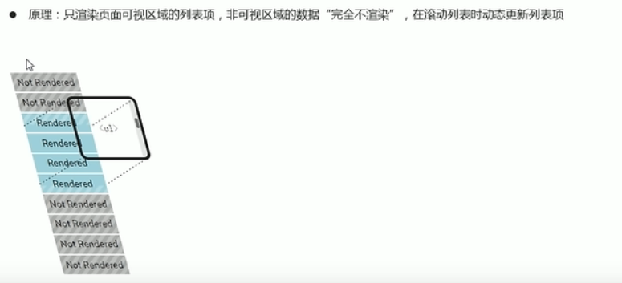
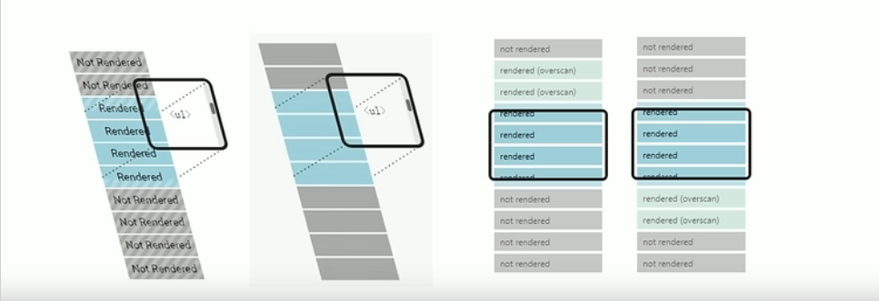
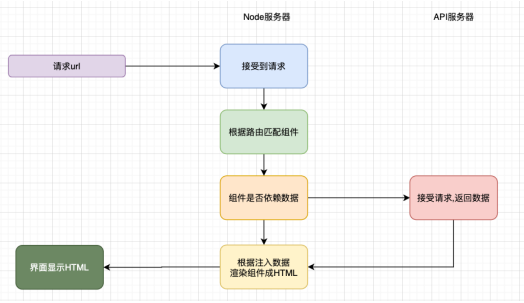

react

只关注视图的js库


发送请求获取数据

处理数据

操作dom呈现页面


jsx
虚拟dom diff算法
css in js 
面向组件编程：
  - 函数式组件
  - 类组件
hooks
react-router
redux
react native
nuxtjs

### react 是什么

是一个声明式，高效且灵活的用于构建用户界面的 JavaScript 库

### 为什么使用react

#### 原生js的痛点

- 原生js操作dom 繁琐、效率低 （dom-api 操作 ui）
- 使用js 直接操作dom，浏览器会进行大量的重绘重排
- 原生js没有组件化编码方案，代码复用率低

#### react 的特点

- 采用组件化模式、声明式编码，提高开发效率及组件复用率
- 在 react native 中可以使用react 语法进行移动端开发
- 使用虚拟dom + 优秀的diffing 算法，尽量减少与真实dom的交互

#### jsx （JavaScript XML）

- 是 react 定义的一种类似于 xml 的 js  扩展语法：js + xml.


本质是 React.createElement(component,props,...children) 方法的语法糖

createElement() 使用繁琐不简洁，不直观，无法一眼看出所描述的结构。

**作用**：用来简化创建虚拟 dom ，解决创建虚拟dom太繁琐的问题。声明式语法使dom结构更直观，与html结构相同，降低学习成本，提升开发效率

**xml**

早期用于存储和传输数据，现在大多使用json（微信接口还是用的xml）

**jsx 语法规则**

- 定义虚拟dom时，不要写引号

- 标签中混入 js 表达式时要用 {}

- React 元素属性名使用驼峰命名法 特殊属性：样式的类名指定不要用 class，要用 className,class -> className 、 tabindex -> tabIndex 

- 内联样式，要用 style={{key:value}} 内层的{} 声明对象。

- 只有一个根标签

- 标签必须闭合，无子级元素时可单标签自闭合如`<span />`

- 标签首字母

  如果要使用自定义 component ，需要大写开头

  - 小写开头，将该标签转为 html 中同名元素，若无该标签对应的同名元素则报错
  - 大写开头，react 去渲染对应的组件，若组件没有定义，则报错

**jsx 编译**
- jsx不是标准的 ECMAScript 语法，是 ECMAScript 的语法扩展。
- 需要使用 babel 编译处理后，才能在浏览器环境中使用。
- creat-react-app 的脚手架中已默认有该配置，无需手动配置
- 编译jsx 语法的包为： @babel/preset-react


**条件渲染**


**jsx 列表渲染**
渲染列表时应该添加key 属性，key 属性的值要保证唯一。
```jsx
 const list = (
    <ul>
      {[1,2,3].map(item => <li key={item}>{item}</li>)}
    </ul>
  )
```
需要尽量避免使用索引号作为 key


**tips**
- 推荐使用小括号包裹 JSX ，从而避免 js 中的自动插入分号陷阱
  ```jsx
  const element = (
    <div>hello jsx</div>
  )
  ```
**总结**
- jsx 是React 的核心内容
- jsx 表示在 js 代码中写 html 结构，是 react 声明式的体现
- 使用 jsx 配合嵌入的 js 表达式、条件渲染、列表渲染，可以描述任意 UI 结构。
- react 完全利用 js 语言自身的能力来编写 UI , 而不是造轮子增强 HTML 功能。
- 
#### 虚拟dom

- 本质是 Object 类型的对象（一般对象）
- 虚拟dom 比较 “轻”（没有真实dom那么多属性），真实dom 比较重
- 虚拟dom 最终会被react 转换成真实dom，渲染在页面上


## react 面向组件编程

组件是 React 的一等公民，使用React 就是在使用 组件
组件表示页面中的部分功能
组合多个组件实现完整的页面功能

react 的思想是完全利用 js 语言的能力创建组件


**特点**：可复用、独立、可组合


### 函数式组件与类式组件


#### 函数式组件
函数组件是使用 js 的函数创建的组件
适用于简单组件

**创建函数式组件**
- 函数名称必须以大写字母开头
- 函数组件必须有返回值，表示该组件的结构
- 返回值为null表示不渲染任何内容
```jsx
function MyComponent(){
    console.log(this);// 此处 this 为 undefined，因为babel 编译后开启了严格模式，不能向上找 window 作为 this
	return (<h2>函数式组件</h2>)
}
```

**渲染到页面**
函数名作为组件标签名使用
```jsx
ReactDOM.render(<MyComponent/>,document.getElementById('test'))
```

执行 ReactDOM.render 后：

- React 解析组件标签，找到了 MyComponent 组件
- 发现组件是使用函数定义的，随后调用该函数，将返回的虚拟dom 转为真实 dom，随后呈现在页面中。

**总结**
- 使用 js 的函数创建的组件被称为函数组件
- 函数组件必须有返回值
- 组件名称必须以大写字母开头，React 据此区分组件和普通的 React 元素

#### 类式组件
- 类组件是使用 ES6 的 class 创建的组件
- 类名称必须以大写字母开头
- 类组件应该继承 React.Component 父类，从而可以使用父类中提供的方法或属性
- 类组件必须提供 render 方法
适用于 复杂组件

**关于类**
```ts
class Person {
	constructor(){}// 构造函数 非必须，需要对实例进行一些初始化操作，如添加指定属性时才写

}
// 实例化该类
new Person()

// 继承类
class Student extends Person (){
    super ()// 继承时使用 super 传递参数给父类  有constructor的情况下必须调用 不添加super 会报错
}
```


**创建类式组件**

```jsx
class MyComponent extends React.Component{
	render(){// render 是在类 MyComponent 的原型对象上，供实例使用的
    console.log(this);// 此处 this 为 MyComponent 组件实例对象
		return (<h2>类式组件</h2>)
    }
}
```

**渲染到页面**

```jsx
ReactDOM.render(<MyComponent/>,document.getElementById('test'))
```

执行 ReactDOM.render 后：

- React 解析组件标签，找到了 MyComponent 组件
- 发现组件是使用类定义的，随后使用 new 操作符 实例化该类， 并通过该实例调用到原型上的 render 方法 
- 将返回的虚拟dom 转为真实 dom，随后呈现在页面中。


#### 有状态组件和无状态组件

状态（state）即数据，组件状态驱动页面（组件状态存储数据，数据改变驱动页面改变）。

无状态（函数）组件，只负责数据展示。
有状态（类）组件，负责更新 UI。


### 组件实例的三大核心属性

#### state
- 状态（state）即数据，是组件内部的私有数据，只能在组件内部使用。通过 this.state 来获取状态
- state 的值是对象，表示一个组件中可以有多个数据。

```jsx
class MyComponent extends React.Component{
  state = {
    count:0
  }
	render(){
		return (<h2>计数器：{this.state.count}</h2>)
    }
}
```

**修改state**
修改state 不能直接修改，只能使用 setState方法：`this.setState({key:value})`  数据驱动视图。

setState() 作用：1. 修改 state  2. 更新 UI

```jsx
class MyComponent extends React.Component{
  state = {
    count:0
  }
	render(){
		return (<h2>计数器：{this.state.count}</h2>
    <button onClick={() => this.setState({count:this.state.count +1})}></button>)
    }
}
```
**更新可能是异步的，因此不能依赖 props 和 state 的值更新下一个状态。可以接收一个函数而不是对象** 

```jsx
this.setState((state, props) => ({
  count: state.count + props.increment
}));

// or 

this.setState(function(state, props) {
  return {
    count: state.count + props.increment
  };
})
```
**state 的更新会被合并，不是替换**


**数据是向下流动的**

除了拥有并设置了state 的组件，其他组件都无法访问 该组件的 state。 组件可以把 state  作为 props 向下传递到子组件中

组件被称为状态机，通过更新组件的 state 更新对应的页面显示。（重新渲染组件）


#### props

**作用**：接收传递给组件的数据
**传递数据**：给组件标签添加属性
**接收数据**：函数组件通过参数 props 接收数据，类组件通过 this.props 接收数据

```jsx
class ChildComponent extends MyComponent {
  render() {
    let { num } = this.props
    return (
      <p>{num}</p>
    );
  }
}
const ChildComponent = (props) => {
    let { num } = props;
  return (
    <p>{num}</p>
  )
}
ReactDOM.render(<ChildComponent num="1" />,document.getElementById("num"))
```


**子组件传递数据给父组件**
利用回调函数，父组件提供一个回调函数（用于接收数据），子组件调用，将要传递的数据作为回调函数的参数
```jsx
class ParentComponent extends MyComponent {
  const getMsg = (msg) => {
    console.log(msg);
  }
  render() {
    return (
      <ChildComponent num="1" getMsg={this.getMsg}  />
    );
  }
}

class ChildComponent extends MyComponent {
  render() {
    let { num,getMsg } = this.props
    return (
      <p onClick={this.props.getMsg('子组件传参')}>{num}</p>
    );
  }
}
const ChildComponent = (props) => {
    let { num,getMsg } = props;
  return (
    <p onClick={this.props.getMsg('子组件传参')}>{num}</p>
  )
}
```


**特点**
- 可以给组件传递任意类型的数据 如函数，jsx
```jsx
class ChildComponent extends MyComponent {
  render() {
    let { num,fn,tag } = this.props
    {props.fn()}
    return (
      <p>{num}</p>
      {tag}
    );
  }
}
ReactDOM.render(<ChildComponent num="1" fn={() => console.log('传递一个函数')} tag={<p>这是一个数字</p>} />,document.getElementById("num"))

```

- 只读性：组件只能读取不能修改自身 props

- 扩展属性：将对象所有属性通过 props 传递

  ```jsx
  ReactDOM.render(<ChildComponent {...params} />,document.getElementById("num"))
  ```
**tips**
使用类组件时，如果写了构造函数，应该将 props 传递给 super() ,否则无法在构造函数中获取到 props 
```jsx
class ChildComponent extends MyComponent {
  constructor(props){
    super(props)// 将 props 传递给 父类构造函数
  }
  render() {
    let { num,fn,tag } = this.props
    {props.fn()}
    return (
      <p>{num}</p>
      {tag}
    );
  }
}
```

- **PropTypes**：

  - 用于对组件的props 进行类型检查

  - cdn 引入 react 时 需单独引入 prop-types 库

    ```html
    <script src="https://unpkg.com/prop-types@15.6/prop-types.js"></script>
    ```

  - 使用：

    - 限制传入的 props 属性类型：

      ```jsx
      // 添加属性规则
      ChildComponent.propTypes = {
          num:PropTypes.number
      }
      // 可以是 js 原生类型、任何可被渲染的元素
      ```

    - 限制该属性为字符串类型的必需属性

      ```jsx
      // 添加属性规则
      ChildComponent.propTypes = {
          num:PropTypes.number.isRequired
      }
      // 可以是 js 原生类型、任何可被渲染的元素
      ```

    - 指定自定义验证器，验证失败时应该返回一个 Error 对象

      ```jsx
       // 请不要使用 `console.warn` 或抛出异常，因为这在 `oneOfType` 中不会起作用。
        customProp: function(props, propName, componentName) {
          if (!/matchme/.test(props[propName])) {
            return new Error(
              'Invalid prop `' + propName + '` supplied to' +
              ' `' + componentName + '`. Validation failed.'
            );
          }
        },
      ```

    - 提供一个自定义的 `arrayOf` 或 `objectOf` 验证器。

      ```jsx
      // 你也可以提供一个自定义的 `arrayOf` 或 `objectOf` 验证器。
        // 它应该在验证失败时返回一个 Error 对象。
        // 验证器将验证数组或对象中的每个值。验证器的前两个参数
        // 第一个是数组或对象本身
        // 第二个是他们当前的键。
        customArrayProp: PropTypes.arrayOf(function(propValue, key, componentName, location, propFullName) {
          if (!/matchme/.test(propValue[key])) {
            return new Error(
              'Invalid prop `' + propFullName + '` supplied to' +
              ' `' + componentName + '`. Validation failed.'
            );
          }
        })
      ```

      

    - 限制单个元素

      通过 PropTypes.element 确保 传递给组件的children 中 只包含一个元素

      ```jsx
      import PropTypes from 'prop-types';
      
      class MyComponent extends React.Component {
        render() {
          // 这必须只有一个元素，否则控制台会打印警告。
          const children = this.props.children;
          return (
            <div>
              {children}
            </div>
          );
        }
      }
      
      MyComponent.propTypes = {
        children: PropTypes.element.isRequired
      };
      
      ```

    - 设置默认值

      通过配置 defaultProps 属性 定义 props 的默认值

      ```jsx
      class Greeting extends React.Component {
        render() {
          return (
            <h1>Hello, {this.props.name}</h1>
          );
        }
      }
      // 指定 props 的默认值：
      Greeting.defaultProps = {
        name: 'Stranger'
      };
      
      // 渲染出 "Hello, Stranger"：
      const root = ReactDOM.createRoot(document.getElementById('example')); 
      root.render(<Greeting />);
      ```

      

    - 从 ES2022 开始，你也可以在 React 类组件中将 `defaultProps` 、`propTypes` 声明为静态属性。欲了解更多信息，请参阅 [class public static fields](https://developer.mozilla.org/en-US/docs/Web/JavaScript/Reference/Classes/Public_class_fields#public_static_fields)。这种现代语法需要添加额外的编译步骤才能在老版浏览器中工作。

    ```jsx
    class Greeting extends React.Component {
      static defaultProps = {
        name: 'stranger'
      }
      static propTypes = {
        name: PropTypes.string.isRequired
      }
      render() {
        return (
          <div>Hello, {this.props.name}</div>
        )
      }
    }
    ```

    - 如果使用的是函数组件，需要在函数组件中以传参形式获取，以保证 PropsTypes 应用正常。

      ```jsx
      export default function HelloWorldComponent({ name }) {
        return (
          <div>Hello, {name}</div>
        )
      }
      ```

- 类组件中的构造函数 和 props

  **如果不初始化 state 或不进行方法绑定，则不需要为 React 组件实现构造函数。**

  **如果为 React.Component 子类实现构造函数，则必须在其他语句之前调用 super(props)。否则，this.props 在构造函数中可能会出现未定义的 bug。**

  通常，在 React 中，构造函数仅用于以下两种情况：

  - 通过给 `this.state` 赋值对象来初始化[内部 state](https://zh-hans.reactjs.org/docs/state-and-lifecycle.html)。

  - 为[事件处理函数](https://zh-hans.reactjs.org/docs/handling-events.html)绑定实例

    在 `constructor()` 函数中**不要调用 `setState()` 方法**。如果你的组件需要使用内部 state，请直接在构造函数中为 **`this.state` 赋值初始 state**

    

- 函数式组件中使用 props,函数式组件中设置 propTypes 和 defaultProps ，只能在 函数外部设置。

  ```jsx
  export default function HelloWorldComponent(props) {
      const { name, age, sex } = props;
    return (
      <div>Hello, {name}</div>
    )
  }
  
  HelloWorldComponent.defaultProps = {
    name: 'Stranger'
  };
  HelloWorldComponent.propTypes = {
    name: PropTypes.string.isRequired
  };
  ```

  

#### refs 与事件处理

##### 事件绑定
react 事件绑定语法与 DOM 事件语法相似
**语法**
on + 事件名称 = {事件处理程序}，如：`onClick={() => {}}`

采用驼峰命名法，如：onMouseEnter、onFocus

```jsx
class MyComponent extends React.Component{
  handleClick(){
    console.log('触发点击事件');
  }
	render(){
		return (<h2 onclick={this.handleClick}>类式组件</h2>)
    }
}

function MyComponent(){
  function handleClick(){
    console.log('触发点击事件');
  }
	return (<h2 onclick={handleClick}>函数式组件</h2>)
}
```

##### 事件对象

可以通过事件处理程序的参数获取到事件对象
react 中的事件对象叫做：合成事件（对象）
合成事件：兼容所有浏览器，无需担心跨浏览器兼容性问题
```jsx
class MyComponent extends React.Component{
  handleClick(e){
    console.log('事件对象',e)
    console.log('触发点击事件');
  }
	render(){
		return (<h2 onclick={this.handleClick}>类式组件</h2>)
    }
}

```


### 组件中的 this

组件中 render 方法中的this 为组件实例对象

组件自定义方法中 this 为 undefined

#### 事件绑定 this 指向
- 强制绑定 this： 通过函数对象的 bind() (Function.prototype.bind())
```jsx
class MyComponent extends React.Component{
  constructor(){
    super()
    this.handleClick = this.handleClick.bind(this)
  }
  handleClick(){
    console.log('自定义方法中的this',this)
    console.log('触发点击事件');
  }
	render(){
		return (<h2 onclick={this.handleClick}>类式组件</h2>)
    }
}

```
- 使用箭头函数

```jsx
class MyComponent extends React.Component{
  handleClick = () => {
    console.log('自定义方法中的this',this)
    console.log('触发点击事件');
  }
	render(){
		return (<h2 onclick={() => this.handleClick}>类式组件</h2>)
    }
}

```
- class 的实例方法：利用箭头函数形式的 class 实例方法(该语法是实验性语法，由于 babel 的存在可以直接使用)

```jsx
class MyComponent extends React.Component{
  handleClick = () => {
    console.log('自定义方法中的this',this)
    console.log('触发点击事件');
  }
	render(){
		return (<h2 onclick={this.handleClick}>类式组件</h2>)
    }
}

```

**总结**


1. 推荐使用 class 的实例方法
2. 箭头函数
3. bind


### 表单处理
**推荐使用受控组件来处理表单**
#### 受控组件

- html 中的表单元素是可输入的，也就是有自己的可变状态
- react 中可变状态通常保存在 state 中，并且只能通过 setState() 方法来修改
- 为了处理这两者的冲突，react 将 state 与表单元素值 value 绑定到一起由 state 的值来控制表单元素的值,进行统一管理。
- 受控组件：其值受到 react 的控制的表单元素


```jsx
<input type="text" value={this.state.text} onChange={e => this.setState({text: e.target.value})} />
```

##### 多表单元素优化
1. 给表单元素添加 name，名称与 state 相同。用于区分各表单元素。
2. 根据表单元素类型获取对应的值
   ```js
   const value = target.type === 'checkbox' ? target.checked : target.value

   // 根据 name 设置对应 state
   this.setState({
    [name]:value
   })
   ```
3. 订单


#### 非受控组件 (DOM) 方式

- 借助 ref ，使用 原生 DOM 方式来获取表单元素值
- ref 的作用： 获取 DOM 或组件

```jsx
// React.createRef() 方法创建一个 ref 对象
constructor(){
  super()
  this.textRef = React.createRef()
}
// 创建好的 ref 对象 添加到文本框
<input type="text" ref={this.textRef} />

// 通过 ref 对象 获取到文本框的值
console.log(this.textRef.current.value);
```


### 组件通讯
#### props
#### 组件通讯的三种方式

##### props 父传子 见上文 props

##### props 子传父

1. 回调函数 父组件提供回调函数，子组件调用，将要传递的数据作为回调函数的参数
   1. 父组件提供一个回调函数（用于接收数据）
   2. 将该函数作为属性的值，传递给子组件
   ```jsx

   ```
2.  

#### Context
#### props深入

### 组件生命周期


### render-props 和高阶组件


#### 高阶组件
##### memo

memo 高阶组件包裹起来的组件有对应的特点：只有props发生改变时，才会重新渲染


### 动态加载组件：
示例：
```jsx
import React, { Suspense } from 'react';
import OtherComponent from './OtherComponent';

React.lazy 函数 像渲染常规组件一样处理动态引入（的组件）
const OtherComponent = React.lazy(() => import('./OtherComponent'));


Suspense 组件中渲染 lazy 组件，可以在等待加载 lazy 组件时做优雅降级（如 loading 指示器等）
function MyComponent() {
  return (
    <div>
      <Suspense fallback={<div>Loading...</div>}>
        <OtherComponent />
      </Suspense>
    </div>
  );
}
```

### 组件切换

React.startTransition 进行组件切换过渡展示，当组件未准备好渲染内容时，展示旧的ui，优化用户体验。

```jsx
function handleTabSelect(tab) {
  startTransition(() => {
    setTab(tab);
  });
}
```


### 异常捕获

模块加载失败（如网络问题）会触发一个错误。可以通过异常捕获便捷技术处理，以显示良好的用户体验并管理恢复事宜。
```jsx
import React, { Suspense } from 'react';
import MyErrorBoundary from './MyErrorBoundary';

const OtherComponent = React.lazy(() => import('./OtherComponent'));
const AnotherComponent = React.lazy(() => import('./AnotherComponent'));

const MyComponent = () => (
  <div>
    <MyErrorBoundary>
      <Suspense fallback={<div>Loading...</div>}>
        <section>
          <OtherComponent />
          <AnotherComponent />
        </section>
      </Suspense>
    </MyErrorBoundary>
  </div>
);
```

### 组件性能优化


## react-router 路由
### 路由基础（BrowserRouter Routes Route）
#### BrowserRouter 用于包裹需要路由的组件，通常在应用的最外层使用。

**HashRouter 作用与`BrowserRouter`一样，但`HashRouter`修改的是地址栏的hash值。**

#### Route
Route 用于定义一个访问路径与 react 组件之间的关系。`path => 路径`  `element => 组件`
- `caseSensitive` 属性用于指定：匹配时是否区分大小写（默认为 false）
#### Routes
Routes 用于包裹一系列Route，决定访问路径对应加载的react组件。 当url发生变化时，Routes 会查看其所有子元素找到对应组件并呈现

```jsx
function App() {
  return (
    <BrowserRouter>
      <Suspense fallback={<div>Loading...</div>}>
        <Routes>
          <Route path="/main" element={<Home />}  />
          <Route path="citylist" element={<CityList />} />
        </Routes>
      </Suspense>
    </BrowserRouter>
  );
}
```


#### 404页面
通配符匹配所有不存在的路径
```jsx
<Route path="*" element={<NotFound />} />
```
#### 嵌套路由
配置嵌套路由，父级路由需 添加 `/*` 才会继续对子路由进行深度匹配。
```jsx
function App() {
  return (
    <Router>
      <Suspense fallback={<div>Loading...</div>}>
        <Routes>
          {/* 父级路由 */}
          <Route path="/main/*" element={<Home />}  >
          </Route>
        </Routes>
      </Suspense>
    </Router>
  );
}

{/* 子级路由 */}
  return (
    <div className="home">
      <Routes>
        <Route path="/" element={<Index />} />
        <Route path="/news" element={<News />} />
        <Route path="/profile" element={<Profile />} />
      </Routes>
    </div>
  );
```
### 路由跳转及传参
#### Link
作用: 修改URL，且不发送网络请求（路由链接）。

```jsx
<Link to="/path">点击跳转路由</Link>
```
#### NavLink
作用: 与 `Link` 组件类似，可实现导航的“高亮”效果。


#### useNavigate
hooks:useNavigate  hooks 只能在 function 组件中使用。

```jsx
import { useNavigate } from "react-router-dom";
const navigate = useNavigate();
navigate('/path');
```
### 路由鉴权


## react hooks
### useState
### useEffect
可以模拟class组件的生命周期，但比生命周期更加强大

一个函数组件中可以有多个useEffect ，按照effect声明的顺序依次执行
```tsx
  // useEffect(回调函数,state 值发生变化时重新执行) 在执行完当前组件渲染后要执行的副作用代码
  // 回调函数完成副作用操作 在组件渲染完成后自动执行 state声明当该值发生变化时回调函数才重新执行，可以传入空数组，不被其它值影响
  // 回调函数返回值:返回一个回调函数取消监听 清除副作用 => 组件被重新渲染或组件卸载时执行
  // 优点：集中处理单一逻辑代码  增加代码内聚性
  useEffect(()=>{
      return () =>{
      }
  },[])
```

### useContext
const value = useContext(MyContext);
接收一个 context 对象（React.createContext 的返回值）并返回该 context 的当前值。
当组件上层最近的 <MyContext.Provider> 更新时，该 Hook 会触发重渲染，并使用最新传递给 MyContext provider 的 context value 值。即使祖先使用 React.memo 或 shouldComponentUpdate，也会在组件本身使用 useContext 时重新渲染。
```tsx
  // 创建 context
  const ThemeContext = React.createContext('light');
  const SizeContext = React.createContext('middle');

  // 提供 context 值
  <ThemeContext.Provider value={'dark'}>
    <SizeContext.Provider value={'small'}>
      <App/>
    </SizeContext.Provider>
  </ThemeContext.Provider>

  // 使用 context 值
  const theme = useContext(ThemeContext)
```
### useReducer
useState 的替代方案，state 逻辑较复杂且包含多个子值，或者下一个 state 依赖于之前的 state 时适用。
接收一个形如 (state, action) => newState 的 reducer，并返回当前的 state 以及与其配套的 dispatch 方法。
使用 useReducer 还能给那些会触发深更新的组件做性能优化，因为你可以向子组件传递 dispatch 而不是回调函数。
```tsx
// 可以选择惰性地创建初始 state。为此，需要将 init 函数作为 useReducer 的第三个参数传入，这样初始 state 将被设置为 init(initialArg)。
function init(initialCount) {
  return {count: initialCount};
}
const [state, dispatch] = useReducer(reducer, initialArg, init);
```
计数器案例：
```tsx
const initialState = {count: 0};
function reducer(state, action) {
  switch (action.type) {
    case 'increment':
      return {count: state.count + 1};
    case 'decrement':
      return {count: state.count - 1};
    default:
      throw new Error();
  }
}

function Counter() {
  const [state, dispatch] = useReducer(reducer, initialState);
  return (
    <>
      Count: {state.count}
      <button onClick={() => dispatch({type: 'decrement'})}>-</button>
      <button onClick={() => dispatch({type: 'increment'})}>+</button>
    </>
  );
}
```
### useMemo
对返回值进行优化
useMemo返回的是一个 memoized（记忆的） 值，在依赖不变的情况下，多次定义的时候，返回的值是相同的。
进行大量的计算操作，是否有必须要每次渲染时都重新计算；
对子组件传递相同内容的对象时，使用useMemo进行性能的优化
```tsx
const memoizedValue = useMemo(
  () => {
    computeValue(a, b);
  },
  [a, b],
);

```
### useCallback
目的:进行性能的优化

把内联回调函数及依赖项数组作为参数传入 useCallback，它将返回该回调函数的 memoized 版本，该回调函数仅在某个依赖项改变时才会更新。

useCallback 用于普通函数**在函数定义方面没有起到优化作用**，虽然记忆内联的回调函数进行函数的重复使用（函数执行完毕时，内部的普通函数会被销毁，函数组件重新渲染时，内部函数重新定义。这里对回调函数进行记忆重复使用最开始定义的回调函数），但是每次组件重新渲染时仍会重新定义useCallback的声明函数。**使用不当会有数据问题，陷入闭包陷阱**。因为每次使用的是最初定义函数时传入的初始值，而不是函数执行后被修改的值。

因此通常使用useCallback的目的是**不希望子组件进行多次渲染**，并不是为了函数进行缓存。
只有当你把回调函数传递给经过优化的并使用引用相等性去避免非必要渲染（例如 shouldComponentUpdate）的子组件时，它将非常有用。
useCallback(fn, deps) 相当于 useMemo(() => fn, deps)。

```tsx
const memoizedCallback = useCallback(
  () => {
    doSomething(a, b);
  },
  [a, b],
);

```
如果用作函数缓存，为了避免闭包陷阱，可以设置依赖项为[],使内部回调函数不因数据变化重新创建，使用 useRef 获取函数中用到的数据更新后的值。

```tsx
const ref = useRef()
const ref2 = useRef()
ref.current = a;
ref2.current = b;
const memoizedCallback = useCallback(
  () => {
    doSomething(ref.current, ref2.current);
  },
  [],
);

```
### useRef
useRef 会在每次渲染时返回同一个 ref 对象.
通过字面量创建对象，每次函数执行组件重新渲染时都会重新创建对象。使用useRef 创建对象，每次渲染时会返回同一个ref对象。
useRef 返回一个可变的 ref 对象，其 .current 属性被初始化为传入的参数（initialValue）。返回的 ref 对象在组件的整个生命周期内持续存在。
当 ref 对象内容发生变化时，useRef 并不会通知你。变更 .current 属性不会引发组件重新渲染。如果想要在 React 绑定或解绑 DOM 节点的 ref 时运行某些代码，则需要使用回调 ref (结合 useCallback 使用: [我该如何测量 DOM 节点](https://zh-hans.reactjs.org/docs/hooks-faq.html#how-can-i-measure-a-dom-node))来实现。
```tsx
function TextInputWithFocusButton() {
  const inputEl = useRef(null);
  const onButtonClick = () => {
    // `current` 指向已挂载到 DOM 上的文本输入元素
    inputEl.current.focus();
  };
  return (
    <>
      <input ref={inputEl} type="text" />
      <button onClick={onButtonClick}>Focus the input</button>
    </>
  );
}
```


```tsx
const refContainer = useRef(initialValue);
```

useRef 返回一个可变的 ref 对象，其 .current 属性被初始化为传入的参数（initialValue）。返回的 ref 对象在组件的整个生命周期内持续存在。


### useImperativeHandle
```tsx
useImperativeHandle(ref, createHandle, [deps])
```
在使用 ref 时自定义暴露给父组件的实例值。在大多数情况下，应当避免使用 ref 这样的命令式代码。useImperativeHandle 应当与 forwardRef 一起使用：

```tsx
function FancyInput(props, ref) {
  const inputRef = useRef();
  useImperativeHandle(ref, () => ({
    focus: () => {
      inputRef.current.focus();
    }
  }));
  return <input ref={inputRef} ... />;
}
FancyInput = forwardRef(FancyInput);
```
在本例中，渲染 <FancyInput ref={inputRef} /> 的父组件可以调用 inputRef.current.focus()。

### useLayoutEffect

其函数签名与 useEffect 相同，但它会在所有的 DOM 变更之后同步调用 effect。可以使用它来读取 DOM 布局并同步触发重渲染。在浏览器执行绘制之前，useLayoutEffect 内部的更新计划将被同步刷新。
尽可能使用标准的 useEffect 以避免阻塞视觉更新。

useEffect会在渲染的内容更新到DOM上后执行，不会阻塞DOM的更新；
useLayoutEffect会在渲染的内容更新到DOM上之前执行，会阻塞DOM的更新；

需要注意 useLayoutEffect 与 componentDidMount、componentDidUpdate 的调用阶段是一样的。但是，官方推荐一开始先用 useEffect，只有当它出问题的时候再尝试使用 useLayoutEffect。


### useDebugValue
### useDeferredValue 延迟更新 **性能优化**
```ts
const deferredValue = useDeferredValue(value);
```
useDeferredValue 接受一个值，并返回该值的新副本，该副本将推迟到更紧急地更新之后。如果当前渲染是一个紧急更新的结果，比如用户输入，React 将返回之前的值，然后在紧急渲染完成后渲染新的值。

该 hook 与使用防抖和节流去延迟更新的用户空间 hooks 类似。使用 useDeferredValue 的好处是，React 将在其他工作完成（而不是等待任意时间）后立即进行更新，并且像 [startTransition](#useTransition) 一样，延迟值可以暂停，而不会触发现有内容的意外降级。

useDeferredValue 仅延迟你传递给它的值。如果你想要在紧急更新期间防止子组件重新渲染，则还必须使用 React.memo 或 React.useMemo 记忆该子组件：


```tsx
function Typeahead() {
  const query = useSearchQuery('');
  const deferredQuery = useDeferredValue(query);

  // Memoizing 告诉 React 仅当 deferredQuery 改变，
  // 而不是 query 改变的时候才重新渲染
  const suggestions = useMemo(() =>
    <SearchSuggestions query={deferredQuery} />,
    [deferredQuery]
  );

  return (
    <>
      <SearchInput query={query} />
      <Suspense fallback="Loading results...">
        {suggestions}
      </Suspense>
    </>
  );
}
```
记忆该子组件告诉 React 它仅当 deferredQuery 改变而不是 query 改变的时候才需要去重新渲染。这个限制不是 useDeferredValue 独有的，它和使用防抖或节流的 hooks 使用的相同模式。


### useTransition 延迟更新 **性能优化**
```tsx
const [isPending, startTransition] = useTransition();
```

返回一个状态值表示过渡任务的等待状态，以及一个启动该过渡任务的函数。
useTransition 告诉react对于某部分任务的更新优先级较低，可以稍后进行更新。

由于react更新视图是统一更新，会出现如果页面加载数据较多时，整体视图加载会滞后，使用 useTransition 可以延后渲染不需要立即更新的视图，在需要即时更新的视图更新完后再渲染。
如列表搜索，由于有过长的列表需要渲染会阻碍搜索项输入变化的即时渲染。input框的输入变化应该是即时渲染，列表渲染可以loading渲染，此时可以对 列表渲染使用 useTransition 

```tsx
function App() {
  const [isPending, startTransition] = useTransition();
  const [count, setCount] = useState(0);
  
  function handleClick() {
    // startTransition 允许你通过标记更新将提供的回调函数作为一个过渡任务：
    startTransition(() => {
      setCount(c => c + 1);
    })
  }

  return (
    <div>
      {/* isPending 指示过渡任务何时活跃以显示一个等待状态： */}
      {isPending && <Spinner />}
      <button onClick={handleClick}>{count}</button>
    </div>
  );
}
```


### useId
useId 是一个用于生成横跨服务端和客户端的稳定的唯一 ID 的同时避免 [hydration](#hydration)  不匹配的 hook。

useId是用于react的同构应用开发的，前端的SPA页面并不需要使用它；
- useId可以保证应用程序在客户端和服务器端生成唯一的ID，这样可以有效的避免通过一些手段生成的id不一致，造成
hydration mismatch；

## redux
帮助管理State，提供了可预测的管理
### 核心思想
**存储数据 Store:state**
**统一操作数据的规范 Action:修改state**
通过**派发（dispatch）action**来更新，action是一个普通的js对象，用来描述这次更新的type和content
type定义对store中的哪一个数据进行更新
content定义更新内容
**Reducer 纯函数 结合state和action**
reducer是一个纯函数，reducer做的事情就是将传入的state和action结合起来生成一个新的state
### 基本使用
#### redux-thunk
action 只能返回普通对象，redux中使用redux-thunk 进行配置，使action能返回函数:
```ts
// 正常情况下 store.dispatch(action) return object,  redux-thunk  使 dispatch 派发的action可以返回函数
export const store = createStore(reducer, composeEnhacers(applyMiddleware(thunk)))
```
### react 结合 redux：react-redux
#### connect 高阶函数结合返回的高阶组件
redux开发中，为了让组件和redux结合起来 需要使用 react-redux 中的connect，需要编写mapStateToProps和 mapDispatchToProps映射的函数：
```tsx
import { connect } from "react-redux";
import { nameAction } from "./redux/modules/user/action";
// props 中读取传入的state和action
function App(props) {
  const { name, changeName } = props;
}
const mapStateToProps = (state) => ({
  name: state.name,
});
const mapDispatchToProps = (dispatch) => ({
  changeName: () => {
    dispatch(nameAction);
  },
});
// connect(要映射到app组件中的数据,组件中可派发的action函数)(组件)
export default connect(mapStateToProps, mapDispatchToProps)(App);

```
#### useSelector useDispatch 简化组件中使用redux的步骤
在Redux7.1开始，提供了Hook的方式，我们再也不需要编写connect以及对应的映射函数了
使用 useSelector 将 redux 中 store 的数据映射到组件内
使用 useDispatch 直接派发action
```tsx
  import { useSelector, useDispatch } from "react-redux";
  import { nameAction } from "./redux/modules/user/action";
  function App(props) {
    const { auth } = useSelector((state:any)=>{
      return {
        auth: state.auth.auth
      }
    })
    const dispatch = useDispatch()
    dispatch(nameAction);
  }
  export default App;

```
#### useSelector 的浅层比较 **性能优化**

 
useSelector 默认监听整个 state，会比较我们返回的两个对象是否相等 `const refEquality = (a, b) => a === b`。
当 useSelector 接收到一个新的引用时，它会**强制重新渲染组件，即使组件的 props 没有改变（memo组件的作用失效）**。
必须返回两个完全相等的对象才可以不引起重新渲染。
直接使用 useSelector useDispatch  修改state，会造成当前使用到state的组件都进行重新渲染（React 会默认递归地重新渲染所有子组件，即当父组件使用了state 时，所有子组件都会被重新渲染，即使大部分组件实际上没有变化）
解决方案：
1. **shallowEqual** 使用 useSelector 时第二个参数传递一个比较函数，接收旧值和新值作为参数，内部会判断两个值是否相同，相同则返回 “true”，那么组件也就不会被重新渲染。
react-redux 提供了比较函数 shallowEqual 可以使用它来检查数组 内部每一项 是否仍然相同
```tsx
const { auth } = useSelector((state:any)=>{
      return {
        auth: state.auth.auth
      }
    },shallowEqual)
```
1. **createSelector** 使用 createSelector 来记忆（Memoize） Selectors
该方法需要安装 reselect，对 useSelector 传入的函数使用 createSelector 进行包装。
createSelector 接收一个或多个 input selector 函数作为参数，外加一个 output selector，并返回新的 selector 函数 输出的结果将被缓存供下次使用。
具体参考官方文档：https://cn.redux.js.org/tutorials/fundamentals/part-7-standard-patterns/


**tips**
在组件中使用多个 Selectors 时每个selectors 都需要使用 对 useSelector 进行 浅层比较处理，如果只有当前使用被修改数据的组件进行了state数据浅层比较处理,其它监听数据未修改的组件没有进行浅层比较处理，监听数据未修改的组件也会进行重新渲染。
### redux的异步操作
### redux-devtool
该chrome插件 react项目默认关闭，开启需在redux中配置:
```ts
// 开启 redux-devtools
const composeEnhacers = (window as any).__REDUX_DEVTOOLS_EXTENSION_COMPOSE__({ trace: true }) || compose;

```

### reducer的模块拆分
reducer 必须是一个纯函数
### @reduxjs/toolkit
官方推荐编写redux的方式


### 纯函数


## 性能优化

### pureComponent
### memo useMemo
### useSelector
### 长列表性能优化

**场景**:展示大型列表和表格数据（比如：城市列表、通讯录、微博等），会导致页面卡顿、滚动不流畅等性能问题。

**产生性能问题的原因**:大量 DOM 节点的重绘和重排（节点在页面滚动中会进行重绘和重排，才会显示在视图中）

**其他原因**: 设备老旧

**其他问题**: 移动设备耗电加快、影响移动设备电池寿命

两种优化方式：懒渲染 & 可视区域渲染
#### 懒渲染（懒加载）
常见的长列表优化方案，常见于移动端
原理：每次只渲染一部分（比如10条数据），等渲染的数据即将滚动完时，再渲染下面部分。

**缺点**
数据量大时，页面中依然存在大量 DOM 节点，占用内存过多，降低浏览器渲染性能，导致页面卡顿。

**使用场景**
数据量不大的情况（比如 1000 条，具体还要看每条数据的复杂程度）

#### 可视区域渲染
react-virtualized

**原理**
只渲染页面可视区域的列表项，非可视区域的数据“完全不渲染”，在滚动列表时动态更新列表项。



在非可视区域，会预加载部分数据，避免快速滚动时，页面白屏问题。



**使用场景**
一次性展示大量数据的情况（比如：大表格、微博、聊天应用等）


## SSR-SPA
node + react + nextjs
SSR（Server Side Rendering，服务端渲染），指的是页面在服务器端已经生成了完成的HTML页面结构，不需要浏览器通过执行js代码，创建页面结构；
对应的是CSR（Client Side Rendering，客户端渲染），我们开发的SPA页面通常依赖的就是客户端渲染；

单页面富应用两个问题：
- 首屏渲染速度
- SEO优化：搜索引擎优化

SPA：
- 下载index.html
- 下载js文件，并且执行js文件

SSR:
借助 Node 完成 下载并执行js文件的功能 => Vue/React SSR API => nuxt/next.js



### SSR 同构应用
**什么是同构？**
一套代码既可以在服务端运行又可以在客户端运行，这就是同构应用。
- 同构是一种SSR的形态，是现代SSR的一种表现形式。
- 当用户发出请求时，先在服务器通过SSR渲染出首页的内容。
- 但是对应的代码同样可以在客户端被执行。
- 执行的目的包括事件绑定等以及其他页面切换时也可以在客户端被渲染；
#### Hydration
在进行 SSR 时，我们的页面会呈现为 HTML。
- 但仅 HTML 不足以使页面具有交互性。例如，浏览器端 JavaScript 为零的页面不能是交互式的（没有 JavaScript 事件处理程序来响应用
户操作，例如单击按钮）。
- 为了使我们的页面具有交互性，除了在 Node.js 中将页面呈现为 HTML 之外，我们的 UI 框架（Vue/React/...）还在浏览器中加载和呈现
页面。（它创建页面的内部表示，然后将内部表示映射到我们在 Node.js 中呈现的 HTML 的 DOM 元素。）
这个过程称为hydration。


## 实践积累
### 自定义高阶组件

#### withRoute => 在class组件中使用hook: useNavigate

### 自定义hook

#### 统一提供context
useGlobalContext
#### 数据存储封装
#### 页面滚动监听
### redux 项目开发体验优化

#### action 拦截 进行日志打印


## 项目开发
学习React开发的模式和编程的思想
React开发的流程、模式、项目架构，项目中会有很多组件、工具等封装、抽取、复用思想；

### 项目规范：开发规范和代码风格
- 1. 文件夹、文件名称统一小写、多个单词以连接符（-）连接；
- 2. JavaScript变量名称采用小驼峰标识，常量全部使用大写字母，组件采用大驼峰；
- 3. CSS采用普通CSS和styled-component结合来编写（全局采用普通CSS、局部采用styled-component）;
- 4. 整个项目不再使用class组件，统一使用函数式组件，并且全面拥抱Hooks；
- 5. 所有的函数式组件，为了避免不必要的渲染，全部使用memo进行包裹；
- 6. 组件内部的状态，使用useState、useReducer；业务数据全部放在redux中管理；
- 7. 函数组件内部基本按照如下顺序编写代码：
  - 组件内部state管理；
  - redux的hooks代码；
  - 其他hooks相关代码（比如自定义hooks）；
  - 其他逻辑代码；
  - 返回JSX代码；
- 8. redux代码规范如下：
  - redux目前我们学习了两种模式，在项目实战中尽量两个都用起来，都需要掌握；
  - 每个模块有自己独立的reducer或者slice，之后合并在一起；
  - redux中会存在共享的状态、从服务器获取到的数据状态；
- 9. 网络请求采用axios
  - 对axios进行二次封装；
  - 所有的模块请求会放到一个请求文件中单独管理；
  - 10.项目使用AntDesign、MUI（Material UI）
  - 爱彼迎本身的设计风格更多偏向于Material UI，但是课程中也会尽量讲到AntDesign的使用方法；
  - 项目中某些AntDesign、MUI中的组件会被拿过来使用；
  - 但是多部分组件还是自己进行编写、封装、实现；
  - 其他规范在项目中根据实际情况决定和编写；

### 项目搭建
#### 项目配置
icon、标题、tsconfig.json:代码提示、配置别名
#### webpack配置
- react 默认隐藏了webpack配置文件入口:
  - 使用 npm run eject 暴露配置文件,操作不可逆
  - 使用 craco 进行 webpack 相关配置。
- react 没有内置less支持，使用 craro craco-less 支持 less 使用
#### 项目目录结构划分
#### css样式的重置
- normalize.css
- reset.css
#### router 配置
- React.lazy 懒加载组件
#### redux 状态管理
- 普通方式
- @reduxjs/toolkit方式：推荐方式，未来趋势
#### 网络请求：axios


## 其他


可实践项目：

俄罗斯方块

贪吃蛇

即时通讯聊天室


 相关技术栈：

react native   跨平台开发

redux  状态管理库

immutable   持久化存储


资源网站、社区：

https://www.reactiflux.com/

https://www.reddit.com/r/reactjs/


细分市场
细分领域
该方向无龙头产品或产品数量多
工具领域
大众需求

1. 坚定自己的生活目标，也就是上一节说的 “北极星”。想想你的理想生活是什么样的？你期待什么样的成功？什么样的旅途才是你真正享受的？
寻找潜在的伙伴。可选项，注意是伙伴，不是员工/老板/投资人。一个好的伙伴通常可以补全你的技能树，并给你带来动力！
2. 想一个好主意😁
3. 构建你的 “最小可用产品” 。不要完美主义！能用就行！
4. 寻找你的第一个客户。主要目标是获得反馈，在上线第一版之前修改产品
5. 上线！不断迭代！


极致
极端简单、极端方便、极端酷炫、极端便宜、极端清奇、**受众极端小众**

1、你的应用确实能够很好的解决用户的痛点；

2、这个功能必须做到极致，极致的背后是口碑的传播。我们程序员不懂销售，但是，必须得懂得极致的背后是口碑传播的道理才行，如果功能做不到极致，体验又不好，就很难自爆了。

https://www.jianshu.com/p/44605b4a5d45
https://w2solo.com/topics/2517

独立开发者社区：
 https://www.indiehackers.com/
 https://w2solo.com/


 重度细分垂直领域  极端体验


 1.立足于一个细分领域，而不是无所不包，什么行业都想涉猎。
 2.精准用户画像，即年龄，性别，地域，生活理念，消费水平等，都要有精确的数据和市场分析。
 3.找准客户画像，越贪心就越做不好。
 4.做好核心产品的爆款。
 5.通过重度运营与用户建立粘性。6.挖掘细分领域，做到第一。
